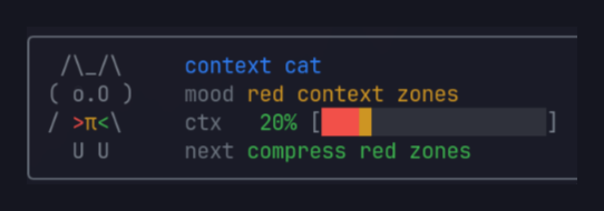

# Context Cat



Animated Pi context-window companion widget.

Context Cat shows a small cat above the editor, tracks current context usage, paints a compact heatmap of useful/noisy/bad context, and can create a handoff session when the context window gets risky.

## Commands

- `/context-cat` — repaint/show the widget
- `/context-cat-handoff` — open a compact Context Cat handoff session immediately

## Behavior

Context Cat follows a simple context-engineering model informed by Anthropic's context-engineering guidance, Martin Fowler's coding-agent context primer, and Chroma's context-rot findings: keep the smallest high-signal context; treat length, ambiguity, distractors, repeated text, raw tool output, and errors as attention pressure.

- Green cells: compact useful context with task anchors such as goals, decisions, constraints, files, tests, expected/actual behavior, verification, and next actions
- Yellow cells: context-rot risk: long entries, raw stdout/stderr, diffs, installs, repeated text, distractor/side-note patterns, weak task anchors, or filler-heavy user text
- Red cells: stack traces, failed extension loads, hard errors, or oversized context entries that should be reread selectively instead of carried raw

Low-signal user text is yellow, not red. It is scored from a standard feature set: filler/hedging words (`just`, `basically`, `maybe`, `probably`, `stuff`, `things`, etc.), ambiguity, weak signal density, repetition, distractor phrases, and missing task anchors like `goal`, `spec`, `decision`, `file`, `test`, `expected`, `actual`, or `next`.

Auto-handoff triggers near high context usage or when red/noisy zones accumulate.

## Install dependencies

```bash
cd ~/.pi/agent/extensions/context-cat
bun install
```

Pi discovers this extension from `~/.pi/agent/extensions/context-cat/index.ts`.
